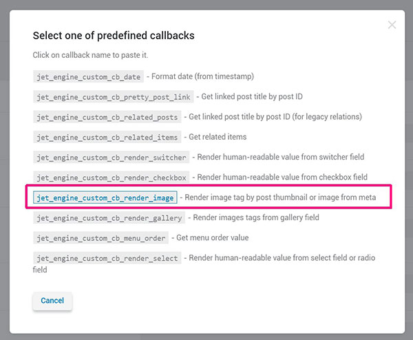

<link rel="stylesheet" href="css/ehd-tut-notes.css" />

# TUTORIAL NOTES

### <div class="tutorial-title">Create a Listing Website WordPress & JetEngine | Real Estate Website in WordPress Elementor (2021)</div>


<a id="top-bookmark-btn" class="bookmark-link" href="#bookmark">JUMP TO BOOKMARK</a>


## VIDEOS


### 00. Introduction

- Basics of using JetEngine to create a more dynamic WordPress website
- JetEngine, Elementor Pro

### 01. Overview

- The project creates a real estate website
- Custom fields not part of normal WP
- Categories in to nav
- Introduce to taxonomies for organizing and categorizing website

#### Plugins

- Classic Editor
- Duplicate Post
- Elementor
- Elementor Pro
- JetEngine


### 02. Terminology

- JetEngine settings in wpadmin menu
- **Post Type:** posts, pages, etc - represents real objects
- **meta fields:** title, content, feat img, etc.
- **taxonomies:** a way to organize content into groups
- We will look at post types, taxonomies, and **listings**
- We WON'T be working with metaboxes


### 03. Creating Custom Post Types

- **To create post type:** JetEngine > Post Types

!!! TIP: You can choose to work with built-in or JetEngine CPTs (custom post types) using the toggle in upper right

#### Create new CPT: 

- Click "Add New"

### 04. General Settings

- **Post Type Name:** Properties
- **Post Type Slug:** properties

### 05. Labels

- Totally optional

### Advanced Settings (08:12)

- These are the changes we need for this project:
- **Has Archive:** enable
- **Hierarchical:** enable [allows multiple levels]
- **Menu Position:** 1 [where displays on left sidebar]
- **Menu icon:** dashicons-admin-multisite
- **Supports:** title, editor, thumbnail (feat img) [built-in meta fields that our custom post can make use of]

## 06. Properties [doesn't really make sense as a timestamp - should delete]

### 07. Meta Fields

- Create first meta field: Property Price

#### Property Price

- Click "New Meta Field"
- **Label:** [human-readable] Property Price
- **Name/ID:** property-price
- **Object Type:** [what kindof field?] Field
- **Field Type:** [what type of data should user input?] Text

!!! TIP: Often works best to set Field Type for numeric values as Text

- **Description:** (optional) Notes to end user
- **Field Width:** 100%
- **Character Limit:** blank
- **Default Value:** blank
- **Is Required:** yes

#### Location 

- **Is Required:** yes

#### Gallery

- **Field Type:** Gallery [upload multiple images as same time]

### Admin Columns (14:14)

- Allows us to insert additional columns into the admin section

- Click "Add Post Type" to save all our settings

- Refresh page and click on "Properties" in the admin menu
  
!!! #GOTCHA: In the Propeties editor by default the only columns are Title and Date

#### Admin Column: Featured Image

- WPADMIN > JetEngine > Post Types > Click "Properties" in Post Type column
- Scroll to bottom and click Admin Columns > Add New
- **Title:** Featured Image
- **Type:** Select from existing callbacks"
  
  `jet_engine_custom_cb_render_image` Render image tag by post thumbnail or image from meta

  - Set Field: thumbnail
  - Size: 100
- **Column Order:** 2



#### ADMIN Column: Property Location

- **Title:** Property Location
- **Type:** Meta Value

- Scroll up to the Location custom field and grab the field ID/Name
- **Field Name:** location
- **Column Order:** 3
- **Is Sortable:** yes

- Update Post Type 
- Go back to the properties list and you can see the new columns are there

NEXT: Creating custom taxonomies


### 08. Creating Custom Taxonomy

- Create Property Types taxonomy
- **JetEngine > Taxonomies > Add New**

**General Settings:**

- **Taxonomy Name:** Property Types
- **Post Type:** Properties

**Labels:**

- (optional)

**Advanced Settings:**

!!! #TIP: Admin Menu is also called admin bar (menu at top in wpadmin)

- **Hierarchical:** Yes

**Meta Fields:**

- Can add extra info to an archive page
- Will deal with this in a different video
- Click "Add Taxonomy" to save
- Refresh -> Now Property Types should be a submenu in wpadmin under "Properties"

---

**Property Types:**

(_Name Slug_)

- Flats flats
- Apartments apartments
- Houses houses


!!! #TIP: The "Parent Category" dropdown only shows up because we set the taxonomy as hierarchical


- Now if we add a new property, we will see the "Property Types" selector metabox on the right

#### Creating a property: Apartment

- Ground Apartment, 2 para, price 350k, London, add 4 pix in gallery
- Add filler text in content
- Prop Type: Apartments
- Choose Featured image
- Price: 350000
- Location: London
- Gallery: Choose a few images
- PUBLISH

---

#### ADD a few more properties:

- Beach Front Studio, Bristol, 1,350,880
- Modern House, Cardiff, 1,209,771
- Beachfront Condo, Miami, Fl, 250,899
- Farmhouse in Kent, 1,322,900

- Now look at Properties list page and all our relevant info should be in the columns

#### #GOTCHA: Had to git rebase to change some older commit messages from README.md to NOTES.md

### 09. Creating Template Files

- Wpadmin > Templates > Theme Builder

!!! #GOTCHA: He has already created templates: Default Footer and Default Header


#### CREATE ARCHIVE

- **Name:** Default Property Archive
- Start from scratch
- You should now see an Elementor editor window with just a header and footer
- In the middle click the "+" plus sign to add a new section > 1 row 1 col
- Add 50px padding top/bottom
  
!!! #TIP: Since we have selected to create an Archive template, special archive-only widgets now are available in the Elementor editor

- Drag in **Archive Posts** widget
- Gear settings left bottom corner

**Preview Settings**

- Properties Archive > Apply and Preview
- Now we should see the 3 dummy property posts we made

- Click the Archive Posts widget

- **Skin:** Cards
- **Image size:** Medium Large
- **Image Ratio:** 0.7
- DISABLE: comments, dates, excerpt, read more, badge, avatar

!!! #TIP: Disabling all those extras gives us a nice, CLEAN layout

- Publish > **Conditions** > Properties Archive > Save and Close

**How to Reference our Post Types:**

- JetEngine > Post Types > Post type Slug
- Copy slug
- **Appearance** > Menus > Main Menu
- **Custom Link:**
  - URL: /properties/
  - Link Text: Properties

!!! #TIP: By using the /[SOMETHING]/ construct for the URL, we make the link domain-agnostic :)

- Set Main Menu as **primary** > Save Menu

---

#### #TIP: Default HEADER

(Left to right)

LOGO white ------------------- Home -- Sample Page -- Properties |  [phone icon][&phone;] NNN-NNN-NNNN

#### #TIP: Default FOOTER

LOGO LARGE color ----------- [SEARCH FIELD -> Enter your email to join our mailing list ]  [button -> Yes, Please -> ]

[HR 100% Width]

Follow Us -- [social icons] ---------------------------- [&copy;] All Rights Reserved


---

- Navigate to Home page
- Click on Properties menu item
- Now you should see our 3 properties in a row -> This is the archive page :)

!!! #GOTCHA: If you click on a post it is a very basic layout with none of the extra custom fields / meta fields we provided. We need to create custom single property template.


### 10. Creating Single Post Template

- Wpadmin > Templates > Single > Properties > Default Property Single > Create Template

!!! #TIP: There are single-post-only widgets available in the Elementor editor now


- ADD SEC: 1 row, 1 col
- Add 50px top/bottom Padding

- Drag **featured image** widget into sec

- Create a 2 col sec [75 / 25]
- Add **post title** into left col
- Add **post content** into left col


**Add Gallery:**

- Drag **gallery** widget (from Pro sec) below post content

- Click the [database] icon (aka: dynamic data) > JetEngine Gallery
- Click wrench icon 🔧
- Click Field > Gallery

- We can now configure the gallery
- **Columns:** 3
- **Image Size:** Medium Large


---

- Add **heading** widget above gallery: Property Gallery

---


#### ADD IN CUSTOM FIELD VALUES

**Price**

- Scroll to bottom to JetEngine's **Listing Elements** sec in Elementor widgets
- Drag **dynamic field** widget into right col
  - Source: Meta Data
  - Meta Field: Property Price

!!! #GOTCHA: The price is just an un-formatted number.

- **Filter field output:**
- Callback: Format Number
  - Decimal points: 0
- **Customize field output:**
- Field format:

```
Price $%s
```

**Location**
- Clone price field
- Field format: `Location: %s`

- Publish > Add Condition:
  - Properties > All > Save and Close

### 11. Custom Listings

- JetEngine has ability to create **custom listings**
- A **listing** is a the way a single post appears in a post list / post grid
- A post list / grid is called a **loop**

- JetEngine > Listings > Add New
- **Listing Source:** Posts
- **From Post Type:** Properties
- **Listing Item Name:** Property Listing
- **Listing View:** Elementor

!!! #TIP: JetEngine works with both Elementor and Gutenberg

- Create Listing Item

---

- Gear Settings lower left - Listing Item Settings:
- **Listing Source:** Posts
- **From Post type:** Properties
- **Preview Width:** 380px

---


- In Elementor Widgets editor: Go to bottom in **Listing Elements** section:
- Drag in **dynamic image** widget
- **Image Size:** Medium large
- **Linked Image:** yes
- **Link Source:** Permalink
- **Alignment:** Center

---

- Add **dynamic field** widget: Title

---

- Add **dynamic field** Meta Data: Property Price
  - Filter field output
  - Callback: Format Number
  - Decimal points: 0
  - Field format: Price $%s

---

- Add **dynamic field** Meta Data: Location
  - Filter field output: DISABLE
  - Field format: Location: $%s

---

- Click the listing section
- Add box shadow
- Add 20px padding
- Publish

!!! #GOTCHA: Page refresh doesn't change the look!

---

- Exit to Dashboard
- Templates
- Default Property Archive > Edit with Elementor
- Delete post archive widget
- Drag in JetEngine Listing Grid widget
- **Listing:** Property Listing

### 12. Outro

- Just stuff about like , subscribe, check out other videos, etc.


---


<a id="bookmark" href="#top-bookmark-btn" title="back to top">BOOKMARK</a>
---

